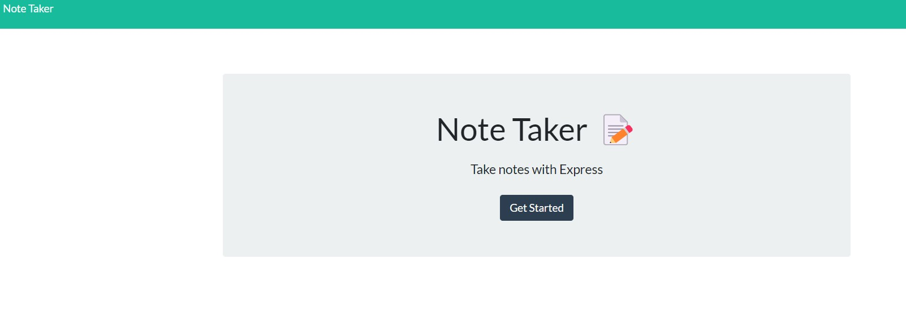

Note Taker
Using express.js

The user can open the application NOTE TAKER
THEN they are presented with a landing page with a link to a notes page

WHEN they click on the link they are presented wit ha page with exising notes listed in the left-hand column, plus empty fields to enter a new note tilte and the note's test in the right-hand column.

Currently, the save icon is not appearing when the note is typed so the note is not being saved.

